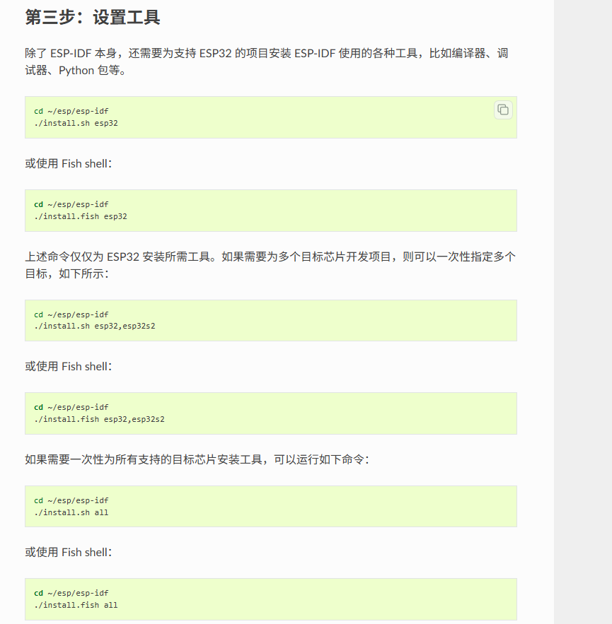
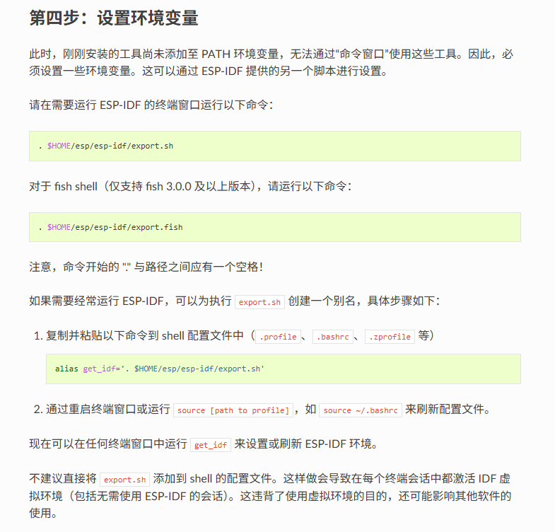

## ESP32 Development Setting

选择官方发布ESP32 IDF SDK ， 优点： 代码/配置/硬件管理 高自由度  缺点: 环境配置/代码编写 困难，复杂

推荐在 Linux 环境下进行开发, 下面是 基于Linux环境和IDF开发ESP32的必要流程:

参考网址： https://docs.espressif.com/projects/esp-idf/zh_CN/stable/esp32/get-started/linux-macos-setup.html#get-started-prerequisites

在Linux(默认是Ubuntu版本)终端运行指令： 

(1) 

``` linux
    sudo apt-get install git wget flex bison gperf python3 python3-pip python3-venv cmake ninja-build ccache libffi-dev libssl-dev dfu-util libusb-1.0-0
```

下载必要工具比如 python3, cmake, venv 等等， 需要注意 Cmake需要3.16及以上的版本，老版本Linux系统运行指令可能下载的是老版本Cmake, 需要先升级系统或者直接下载Cmake3

(2) 

在github找到 ESP32 IDF 仓库（https://github.com/espressif/esp-idf），并克隆到本地目录下  // 或者下载 ESP32 IDF 下载工具, emm 我也不知道哪一个更好

(3)

(4)  为（3）下载的一些依赖工具，配置环境变量，否则系统无法找到工具并使用。


(5) 结束-> 可以根据下载好的ESP IDF中的Example开始，
可以参考： https://blog.csdn.net/qq_36347513/article/details/117527078，
以及： https://docs.espressif.com/projects/esp-idf/zh_CN/stable/esp32/get-started/linux-macos-setup.html#get-started-prerequisites


# Example的项目核心文件：

-> CMakeLists.txt ： 是CMake构建项目是需要参考的配置文件，其中包括源代码，头文件，依赖库等等（通常每个功能模块都需要一个CMakeLists.txt）
-> main/          ： 主程序模块（必须有）
-> components     :  自定义模块
-> build          :  不用理会